<div dir="rtl" align="right">

# مکان‌یابی دوبعدی ربات و همجوشی حسگرها با مدل ⁦MAP⁩ روی گراف فاکتوری
## گزارش جامع پروژه

**درس:** مدل‌های گرافی احتمالاتی، دانشگاه فردوسی مشهد &nbsp;|&nbsp; **استاد:** دکتر احد هراتی &nbsp;|&nbsp; سال تحصیلی ۱۴۰۴–۱۴۰۵

کد کامل در ⁦`src/robot_pgm/`⁩، اسکریپت اجرا در ⁦`scripts/run_project.py`⁩، و تست‌ها در ⁦`tests/test_project.py`⁩ قرار دارند. **همه‌ی اعداد، جدول‌ها و شکل‌های این گزارش مستقیماً از اجرای این کد تولید شده‌اند** — هیچ عددی دستی وارد نشده و هیچ شکلی دستی ویرایش نشده است.

---

## فهرست

0. معماری پیاده‌سازی و نحوه‌ی کار کد
1. تعریف مسئله، متغیرها، مشاهده‌ها و قرارداد اندازه‌گیری
2. مدل گرافی، فاکتورگیری پسین، دامنه‌ی فاکتورها و استقلال‌های شرطی
3. روش حل، ابزار، مقدار اولیه، مدل نویز و تنظیمات
4. آزمایش‌ها (حذف مؤلفه، حساسیت به نویز، بستن حلقه، داده‌ی ناسازگار، مدل مقاوم)
5. نتایج عددی و نموداری
6. تحلیل عدم‌قطعیت و بیضی کوواریانس
7. بحث ⁦PGM⁩ (⁦Markov blanket⁩، حاشیه‌سازی، تنکی، متغیر نهان قابلیت اعتماد)
8. محدودیت‌ها، شکست‌ها و راهنمای اجرای دقیق

---

## ۰. معماری پیاده‌سازی و نحوه‌ی کار کد

### ساختار کلی

<div dir="ltr" align="left">

```
robot/
├── configs/reference.yaml       # قرارداد داده و مدل نویز نامی
├── data/                        # دیتاست مرجع (prior, odometry, gps, loops, landmarks, ground truth)
├── starter/se2_utils.py         # توابع آماده‌ی SE(2) (wrap زاویه، ترکیب/تفاضل وضعیت)
├── src/robot_pgm/
│   ├── io_utils.py               # بارگذاری + اعتبارسنجی کامل داده
│   ├── factor_graph.py           # هسته‌ی PGM: فاکتورها، ژاکوبین تحلیلی، حل MAP، IRLS مقاوم، کوواریانس
│   ├── pgm_analysis.py           # Markov blanket، شبیه‌سازی fill-in، ترتیب‌دهی min-degree
│   ├── evaluation.py             # معیارهای ارزیابی نهایی؛ بدون ساخت گراف یا تنظیم مدل
│   └── plotting.py               # همه‌ی شکل‌ها
├── requirements.txt              # نسخه‌های دقیق کتابخانه‌های اجرای مرجع
├── README.md                     # راهنمای کوتاه نصب، تست و اجرا
├── scripts/run_project.py       # اجرای کامل end-to-end
├── tests/test_project.py        # تست واحد (ژاکوبین، قرارداد داده، رفتار وزن مقاوم)
└── results/                     # خروجی: figures/, tables/, results.json, trajectories/
```

</div>

### جریان اجرا (⁦`run_project.py`⁩)

۱. ⁦`load_dataset`⁩ همه‌ی فایل‌های ⁦CSV⁩ و ⁦YAML⁩ را می‌خواند و اعتبارسنجی می‌کند (بخش ۱ پایین‌تر جزئیات کامل را دارد).
۲. با ⁦`se2_utils.integrate_odometry`⁩ مسیر ⁦dead-reckoning⁩ ساخته می‌شود — این هم ⁦baseline⁩ ارزیابی است، هم مقدار اولیه‌ی یکسان برای همه‌ی مدل‌های بعدی.
۳. برای هر ترکیب حسگری (⁦`FactorGraph(ds, include_gps=..., include_loops=..., include_landmarks=...)`⁩) یک گراف فاکتوری جدید ساخته و با ⁦`.solve()`⁩ حل می‌شود.
۴. مدل کامل یک‌بار دیگر با ⁦`robust=True`⁩ و **همان مقدار اولیه‌ی مشترک Dead Reckoning** حل می‌شود.
۵. ⁦`pgm_analysis`⁩ روی گراف ⁦pose⁩ها اجرا می‌شود: ⁦Markov blanket⁩ برای دو ⁦pose⁩ نمونه، و شبیه‌سازی ⁦fill-in⁩ برای سه ترتیب حذف متغیر.
۶. پس از پایان همه‌ی حل‌های گاوسی و مقاوم، آزمایش حساسیت، محاسبه‌ی کوواریانس و تحلیل ساختاری PGM، اسکریپت ⁦`run_project.py`⁩ فایل ⁦`ground_truth.csv`⁩ را از طریق تابع اختصاصی ⁦`load_ground_truth_for_evaluation_only`⁩ بارگذاری می‌کند و آن را فقط برای معیارهای نهایی و شکل‌های مقایسه‌ای به ⁦`evaluation`⁩ می‌دهد.
۷. ⁦`plotting`⁩ همه‌ی شکل‌ها را می‌سازد؛ همه‌چیز در ⁦`results/`⁩ ذخیره می‌شود.

### هسته‌ی محاسباتی: کلاس ⁦`FactorGraph`⁩

هر ردیف از هر فایل ⁦CSV⁩ به یک شیء ⁦`Factor`⁩ تبدیل می‌شود: نوع (⁦`prior`⁩/⁦`odometry`⁩/⁦`gps`⁩/⁦`loop`⁩/⁦`landmark`⁩)، شناسه، دامنه (لیست شناسه‌ی ⁦pose⁩هایی که به آن‌ها وصل است)، مقدار اندازه‌گیری‌شده، و ⁦$\sigma$⁩. برای هر فاکتور دو تابع نوشته شده:

- **باقی‌مانده (⁦residual⁩):** طبق فرمول‌های بخش ۳ سند، دقیقاً همان ⁦$h(\cdot)-z$⁩ با ⁦`wrap`⁩ روی مؤلفه‌ی زاویه‌ای.
- **ژاکوبین تحلیلی:** مشتق دقیق همان تابع نسبت به هر ⁦pose⁩ در دامنه‌اش (فرمول‌ها در بخش ۳ پایین‌تر آمده‌اند). این ژاکوبین‌ها با یک تست واحد (⁦`test_analytic_jacobian_matches_finite_differences`⁩) در برابر تفاضل مرکزی روی ۲۴ ستون تصادفی از بردار حالت راستی‌آزمایی شده‌اند؛ بیشینه‌ی خطای مشاهده‌شده کمتر از ⁦$10^{-4}$⁩ است.

باقی‌مانده‌ی هر فاکتور با ⁦$\sigma$⁩ خودش «سفید» (⁦whitened⁩) می‌شود، و همه‌ی فاکتورها در یک بردار باقی‌مانده‌ی بزرگ و یک ماتریس ژاکوبین تُنُک (فقط ستون‌های مربوط به ⁦pose⁩های دامنه‌ی هر فاکتور غیرصفرند) کنار هم چیده می‌شوند. حل عددی با ⁦`scipy.optimize.least_squares`⁩ روی همین بردار/ماتریس انجام می‌شود.

### چرا این معماری؟

طراحی کد عمداً «فاکتور به‌عنوان واحد اول‌درجه» است — یک شیء ⁦`Factor`⁩ با دامنه‌ی صریح، نه صرفاً یک ردیف در یک ماتریس بزرگ. این انتخاب دقیقاً بازتاب نمایش **گراف فاکتوری** در مدل‌های گرافی احتمالاتی است: مدل به‌جای این‌که با کلیک‌های از پیش تعریف‌شده روی یک گراف مشخص شود، مستقیماً از یک مجموعه فاکتور محلی ساخته می‌شود، و گراف زیرین (این‌که کدام ⁦pose⁩ها به‌هم مرتبطند) از دامنه‌ی خودِ فاکتورها القا می‌شود. همین ساختار داده باعث می‌شود تحلیل‌های بخش ۷ (⁦Markov blanket⁩، ⁦fill-in⁩) بدون نوشتن کد جداگانه، مستقیماً از همان تعریف فاکتورها قابل استخراج باشند.

---

## ۱. تعریف مسئله، متغیرها، مشاهده‌ها و قرارداد اندازه‌گیری

**متغیر پنهان.** مسیر ربات ⁦$X=\{x_0,\dots,x_{259}\}$⁩ با ⁦$x_t=(x_t,y_t,\theta_t)\in SE(2)$⁩؛ ۲۶۰ وضعیت، هرکدام سه‌بعدی، در مجموع بردار حالت با بُعد ۷۸۰.

**مشاهده‌ها.** جمعاً ۴۰۱ فاکتور مشاهداتی:

| مجموعه | فایل | تعداد | دامنه‌ی فاکتور | مدل نویز نامی (⁦$\sigma$⁩) |
|---|---|---:|---|---|
| ⁦prior⁩ | ⁦`initial_prior.csv`⁩ | ۱ | ⁦$x_0$⁩ | ⁦$(0.150,\,0.150,\,0.080)$⁩ |
| ⁦odometry⁩ | ⁦`odometry.csv`⁩ | ۲۵۹ | ⁦$(x_{t-1},x_t)$⁩ | ⁦$(0.055,\,0.035,\,0.018)$⁩ |
| ⁦gps⁩ | ⁦`gps.csv`⁩ | ۳۳ | ⁦$x_t$⁩ | ⁦$(0.62,\,0.62)$⁩ |
| ⁦loop closure⁩ | ⁦`loop_closures.csv`⁩ | ۸ | ⁦$(x_i,x_j)$⁩، ⁦$j-i\gg1$⁩ | ⁦$(0.16,\,0.16,\,0.045)$⁩ |
| ⁦landmark⁩ | ⁦`landmark_observations.csv`⁩ | ۱۰۰ | ⁦$x_t$⁩ (نقطه‌ی شاخص ⁦$\ell_k$⁩ ثابت و معلوم است، متغیر پنهان نیست) | ⁦$(0.22,\,0.045)$⁩ فاصله-زاویه |

**توابع پیش‌بینی** (دقیقاً طبق سند، در ⁦`factor_graph.py`⁩):

<div dir="ltr" align="left">

$$h_{\text{rel}}(x_i,x_j)=\begin{bmatrix}R(\theta_i)^T(p_j-p_i)\\ \operatorname{wrap}(\theta_j-\theta_i)\end{bmatrix},\qquad
h_{\text{gps}}(x_t)=\begin{bmatrix}x_t\\y_t\end{bmatrix},\qquad
h_{\text{lm}}(x_t,\ell_k)=\begin{bmatrix}\sqrt{(\ell_k^x-x_t)^2+(\ell_k^y-y_t)^2}\\ \operatorname{wrap}(\operatorname{atan2}(\ell_k^y-y_t,\ell_k^x-x_t)-\theta_t)\end{bmatrix}$$

</div>

باقی‌مانده‌ی هر فاکتور ⁦$r=h(\cdot)-z$⁩ است، با ⁦`wrap`⁩ روی مؤلفه‌ی زاویه‌ای باقی‌مانده.

**اعتبارسنجی داده (پیش از هر مدل‌سازی).** ⁦`io_utils.validate_dataset`⁩ بررسی می‌کند: وجود همه‌ی ستون‌های موردنیاز، محدود‌بودن (⁦finite⁩) همه‌ی مقادیر عددی، وجود دقیقاً یک ⁦prior⁩ روی ⁦pose⁩ صفر، اتصال زنجیره‌ای دقیق اودومتری (⁦$0\to1\to\dots\to259$⁩، بدون جاافتادگی)، معتبربودن (⁦within-range⁩) هر ⁦`pose_id`⁩/⁦`from_id`⁩/⁦`to_id`⁩ در ⁦GPS/loop/landmark⁩، ارجاع‌های سالم ⁦`landmark_id`⁩ (هر نقطه‌ی مشاهده‌شده باید در ⁦`landmarks.csv`⁩ تعریف شده باشد)، و مثبت‌بودن همه‌ی ⁦$\sigma$⁩ها. اگر هرکدام نقض شود، بارگذاری با خطا متوقف می‌شود — یعنی هیچ گراف فاکتوری روی داده‌ی نامعتبر ساخته نمی‌شود.

**قانون استفاده از مسیر مرجع.** ساخت همه‌ی گراف‌ها، انتخاب تنظیمات، حل مدل‌های گاوسی و مقاوم، تحلیل باقی‌مانده‌ها، آزمایش حساسیت نویز، محاسبه‌ی کوواریانس و تحلیل ساختاری PGM پیش از بارگذاری مسیر مرجع انجام می‌شود. تنها پس از پایان این مراحل، ⁦`run_project.py`⁩ تابع مجزای ⁦`load_ground_truth_for_evaluation_only`⁩ را صدا می‌زند و داده را فقط برای محاسبه‌ی معیارهای نهایی و رسم شکل‌های مقایسه‌ای به ⁦`evaluation.py`⁩ می‌دهد. این تابع در ⁦`factor_graph.py`⁩ و ⁦`pgm_analysis.py`⁩ وارد نشده و شیء ⁦`Dataset`⁩ نیز فیلدی برای Ground Truth ندارد. تست ⁦`test_ground_truth_not_smuggled_into_dataset`⁩ جداسازی ساختاری را صریحاً بررسی می‌کند.

---

## ۲. مدل گرافی، فاکتورگیری پسین، دامنه‌ی فاکتورها و استقلال‌های شرطی

توزیع پسین به‌صورت زیر فاکتورگیری می‌شود:

<div dir="ltr" align="left">

$$p(X\mid Z)\ \propto\ \phi_0(x_0)\ \prod_{t=1}^{259}\psi_t(x_{t-1},x_t)\ \prod_{m\in G}\gamma_m(x_m)\ \prod_{(i,j)\in L}\lambda_{ij}(x_i,x_j)\ \prod_{(t,k)\in M}\eta_{tk}(x_t;\ell_k)$$

</div>

که در آن ⁦$\phi_0\leftrightarrow$⁩ ⁦prior⁩، ⁦$\psi_t\leftrightarrow$⁩ ⁦odometry⁩، ⁦$\gamma_m\leftrightarrow$⁩ ⁦GPS⁩، ⁦$\lambda_{ij}\leftrightarrow$⁩ ⁦loop closure⁩، ⁦$\eta_{tk}\leftrightarrow$⁩ ⁦landmark.⁩ **استقلال شرطی فرض‌شده:** مشاهده‌ها، مشروط به مسیر کامل ⁦$X$⁩، از یکدیگر مستقل‌اند (نویز حسگرها مستقل فرض شده)، و هر فاکتور فقط از طریق دامنه‌ی خودش (یک یا دو گره) به گراف وصل است.

با فرض نویز گاوسی روی هر فاکتور، ⁦$-\log p(X\mid Z)$⁩ (تا یک ثابت جمعی) دقیقاً مجموع فاصله‌های ماهالانوبیس باقی‌مانده‌هاست، پس ⁦MAP⁩ معادل زیر است:

<div dir="ltr" align="left">

$$X^\star=\arg\min_X\sum_{a\in\mathcal F}\rho_a\Big(\lVert r_a(X_a;z_a)\rVert^2_{\Sigma_a^{-1}}\Big),\qquad \rho_a(s)=s \text{ برای مدل گاوسی ساده}$$

</div>

### گراف پوزها و ساختار مارکوفی

گراف مارکوفِ زیرین بین ⁦pose⁩ها را فقط فاکتورهای دوتایی (⁦odometry⁩ و ⁦loop closure⁩) می‌سازند — هر ردیف از این دو فایل یک یال بین دو ⁦pose⁩ اضافه می‌کند؛ فاکتورهای تک‌متغیره (⁦GPS⁩، ⁦landmark⁩، ⁦prior⁩) یالی اضافه نمی‌کنند، فقط پتانسیل محلی همان یک ⁦pose⁩ را تغییر می‌دهند. این گراف با ⁦`pgm_analysis.pose_adjacency`⁩ مستقیماً از فایل‌های داده ساخته می‌شود و پایه‌ی همه‌ی تحلیل‌های بخش ۷ است.

### ⁦Markov blanket⁩ — دو نمونه‌ی واقعی

⁦Markov blanket⁩ یک ⁦pose⁩ برابر است با اتحاد دامنه‌ی همه‌ی فاکتورهایی که به آن وصل‌اند، منهای خودش. مشروط بر بلنکت، آن ⁦pose⁩ از بقیه‌ی مسیر مستقل شرطی است — چون هر فاکتوری که آن ⁦pose⁩ در دامنه‌اش نیست، بعد از شرطی‌کردن روی بلنکت، دیگر تابعی از آن ⁦pose⁩ نیست.

**⁦pose 0⁩** (خروجی واقعی تابع ⁦`markov_blanket`⁩):
<div dir="ltr" align="left">

```json
{"neighbor_pose_ids": [1, 84],
 "odometry_factors": ["odom(0,1)"], "loop_factors": ["loop_0(0,84)"],
 "gps_factors": ["gps_0"], "landmark_factors": ["lm_0", "lm_1"]}
```

</div>
یعنی مشروط بر ⁦$\{x_1,x_{84}\}$⁩ (به‌علاوه‌ی مشاهدات تک‌متغیره‌ی خودش)، ⁦$x_0$⁩ از بقیه‌ی ۲۵۸ وضعیت مستقل شرطی است.

**⁦pose 118⁩** (سرِ یکی از بستن‌حلقه‌ها):
<div dir="ltr" align="left">

```json
{"neighbor_pose_ids": [117, 119, 228],
 "odometry_factors": ["odom(117,118)", "odom(118,119)"],
 "loop_factors": ["loop_7(118,228)"], "gps_factors": [], "landmark_factors": []}
```

</div>
این ⁦pose⁩ هیچ فاکتور تک‌متغیره‌ای (نه ⁦GPS⁩، نه ⁦landmark⁩) ندارد؛ بلنکتش کاملاً ساختاری است. تنها راه رسیدن اطلاعات مطلق (نه فقط نسبی) به این ⁦pose⁩، از طریق همان یک بستن‌حلقه است — نکته‌ای که در بخش ۴ اهمیتش روشن می‌شود، چون همین بستن‌حلقه به‌شدت ناسازگار است.

---

## ۳. روش حل، ابزار، مقدار اولیه، مدل نویز و تنظیمات

**ابزار عددی.** طبق اجازه‌ی صریح سند («مجاز است برای حل عددی از ابزار آماده مثل ⁦GTSAM⁩، ⁦g2o⁩ یا ⁦scipy.optimize.least_squares⁩ استفاده کند»)، حل‌کننده‌ی ⁦`scipy.optimize.least_squares`⁩ استفاده شده؛ هیچ ⁦Gauss-Newton/Levenberg-Marquardt⁩‌ای از صفر نوشته نشده. آنچه دستی نوشته شده، خودِ مدل است: فاکتورها، دامنه‌ها، باقی‌مانده‌ها، **ژاکوبین‌های تحلیلی**، مدل نویز، و منطق مقاوم‌سازی.

**مقدار اولیه‌ی ⁦$X_0$⁩.** برای همه‌ی مدل‌ها یکسان: زنجیره‌کردن اودومتری خام با ⁦`se2_utils.integrate_odometry`⁩ (تابع آماده‌ی بسته‌ی داده) از میانگین ⁦prior.⁩ بدون هیچ استفاده‌ای از ⁦ground truth.⁩

**انتخاب حل‌کننده‌ی خطیِ داخلی، بر اساس اندازه/تعیّن زیرمسئله:**

| زیرمسئله | نسبت باقی‌مانده به متغیر | حل‌کننده |
|---|---|---|
| ⁦`odometry_only`⁩, ⁦`odometry_loops`⁩ (نزدیک به تعیّن کامل) | باقی‌مانده تقریباً برابر متغیر | ⁦Levenberg⁩–⁦Marquardt⁩ چگال |
| ⁦`odometry_gps`⁩, ⁦`odometry_landmarks`⁩, ⁦`all_gaussian`⁩, ⁦`all_robust`⁩ (به‌خوبی معیّن) | باقی‌مانده به‌مراتب بیشتر از متغیر | ⁦trust-region-reflective⁩ + حل خطی تُنُک (⁦`lsmr`⁩) روی الگوی تُنُکیِ واقعیِ ژاکوبین |

این انتخاب فقط زیرمسئله‌ی خطیِ داخل هر گام تکرار ⁦Gauss-Newton⁩ را عوض می‌کند و **مدل، فاکتورها، ⁦$\Sigma$⁩ها، و مقدار اولیه در همه‌جا کاملاً یکسان می‌مانند**؛ توجیهش صرفاً عددی است: در زیرمسئله‌های نزدیک به تعیّن کامل، حل خطیِ تقریبیِ ⁦Krylov⁩ (⁦`lsmr`⁩) دقت کافی برای جهت گام نمی‌دهد، در حالی‌که حل خطیِ دقیق (چگال) در این ابعاد (≤۷۸۰ متغیر) هم دقیق و هم ارزان است. با این انتخاب، هر ۶ مدل گاوسی (⁦dead reckoning⁩ تا ⁦all_gaussian⁩) کامل و با موفقیت (⁦`success=True`⁩) همگرا می‌شوند.

**زمان‌بندی اجرای مرجع مدل کامل گاوسی:** هدف اولیه ⁦$120{,}755.2456$⁩؛ پس از حل ⁦$10{,}446.4579$⁩؛ ۶۰ فراخوانی تابع؛ زمان ساخت گراف ۰.۰۰۱۳ ثانیه و زمان حل ۰.۵۹۱۳ ثانیه. زمان‌ها به سخت‌افزار و بار سیستم وابسته‌اند و مقادیر دقیق هر اجرا در ⁦`results/tables/ablation_metrics.csv`⁩ و ⁦`results/results.json`⁩ ثبت می‌شوند.

**مدل نویز نامی** بدون تغییر از ⁦`configs/reference.yaml`⁩ (جدول بخش ۱).

---

## ۴. آزمایش‌ها

### ۴.۱ حذف مؤلفه‌های حسگری (⁦ablation⁩)

همه‌ی مدل‌ها از یک ⁦$X_0$⁩ یکسان (⁦dead reckoning⁩) شروع شده‌اند:

| مدل | ⁦RMSE⁩ (⁦m⁩) | ⁦Final drift⁩ (⁦m⁩) | حل‌کننده | ⁦nfev⁩ | همگرا؟ |
|---|---:|---:|---|---:|---|
| ⁦dead reckoning⁩ | ۸.۹۲۱ | ۱۲.۲۱۲ | - | - | - |
| ⁦odometry_only⁩ | ۸.۹۲۱ | ۱۲.۲۱۲ | ⁦LM⁩ چگال | ۲ | ✓ |
| ⁦odometry_gps⁩ | ۱.۳۴۱ | ۰.۴۳۱ | ⁦trf/lsmr⁩ | ۱۲۰ | ✓ |
| ⁦odometry_loops⁩ | ۵.۷۳۴ | ۸.۶۱۳ | ⁦LM⁩ چگال | ۲۶ | ✓ |
| ⁦odometry_landmarks⁩ | ۰.۲۶۶ | ۰.۰۷۷ | ⁦trf/lsmr⁩ | ۱۵ | ✓ |
| ⁦all_gaussian⁩ | ۱.۲۴۳ | ۰.۰۳۴ | ⁦trf/lsmr⁩ | ۶۰ | ✓ |
| **⁦all_robust⁩** | **۰.۱۵۵** | ۰.۰۲۹ | ⁦trf/lsmr⁩ + ⁦IRLS⁩ | ۱۴۳ | ✓ |

⁦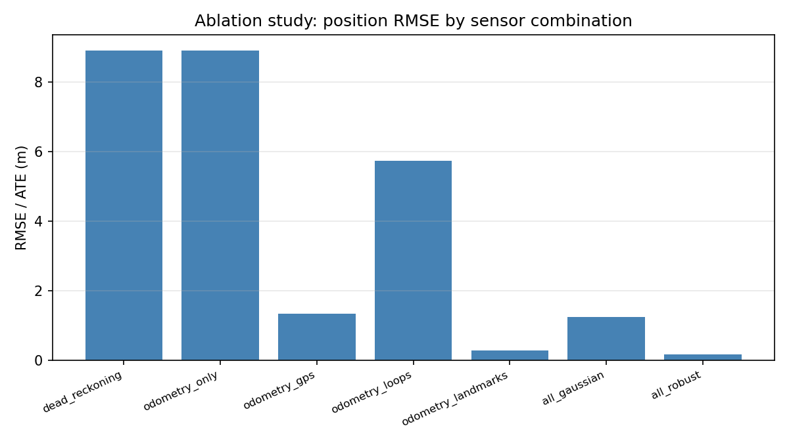⁩

جدول زمان اجرای مرجع نیز نشان می‌دهد زمان ساخت خود گراف در همه‌ی مدل‌ها در حد چند میلی‌ثانیه است و بخش اصلی هزینه به حل عددی مربوط می‌شود:

| مدل | زمان ساخت گراف (s) | زمان حل (s) | ⁦nfev⁩ |
|---|---:|---:|---:|
| ⁦odometry_only⁩ | ۰٫۰۰۰۶ | ۰٫۱۸۳۵ | ۲ |
| ⁦odometry_gps⁩ | ۰٫۰۰۰۸ | ۰٫۹۹۴۶ | ۱۲۰ |
| ⁦odometry_loops⁩ | ۰٫۰۰۰۹ | ۴٫۳۹۶۱ | ۲۶ |
| ⁦odometry_landmarks⁩ | ۰٫۰۰۲۵ | ۰٫۲۵۶۵ | ۱۵ |
| ⁦all_gaussian⁩ | ۰٫۰۰۱۳ | ۰٫۵۹۱۳ | ۶۰ |
| ⁦all_robust⁩ | ۰٫۰۰۱۴ | ۱٫۳۹۶۵ | ۱۴۳ |

نقاط شاخص به‌تنهایی مؤثرترین حسگر منفرد است (⁦RMSE⁩≈۰.۲۷ متر) چون هم فاصله هم زاویه به مرجع مطلق می‌دهد. بستن‌حلقه به‌تنهایی (به‌همراه اودومتری) کمترین بهبود را می‌دهد (⁦RMSE⁩≈۵.۷۳ متر)، چون دو مورد از هشت بستن‌حلقه به‌شدت ناسازگارند (بخش ۴.۳) و بدون هیچ حسگر دیگری که این ناسازگاری را «متعادل» کند، اثر منفی‌شان غالب می‌شود.

### ۴.۲ حساسیت به نویز ⁦GPS⁩

سه تنظیم با بازه‌ی وسیع (⁦$0.2\times$⁩, ⁦$1\times$⁩, ⁦$5\times$⁩ مقدار نامی ⁦$\sigma_{\text{gps}}$⁩) بررسی شد تا اثر «اعتماد بیش‌ازحد در برابر کمتر‌ازحد» — که سند صریحاً خواسته — واقعاً قابل مشاهده باشد:

| ⁦$\sigma_{\text{gps}}$⁩ | ⁦RMSE⁩ (⁦m⁩) | ⁦Final drift⁩ (⁦m⁩) | تابع هدف نهایی | میانگین مساحت بیضی ۹۵٪ (⁦m⁩²) |
|---|---:|---:|---:|---:|
| ⁦$0.2\times$⁩ (اعتماد بیش‌ازحد) | **۱.۴۲۶** | ۰.۳۳۱ | ۱۳۷۵۱.۱۶ | **۰.۱۰۹** |
| ⁦$1\times$⁩ (نامی) | ۱.۲۴۳ | ۰.۰۳۴ | ۱۰۴۴۶.۴۶ | ۰.۱۳۳ |
| ⁦$5\times$⁩ (اعتماد کمتر) | ۱.۲۵۸ | ۰.۰۱۴ | ۱۰۲۲۱.۵۹ | ۰.۱۳۴ |

⁦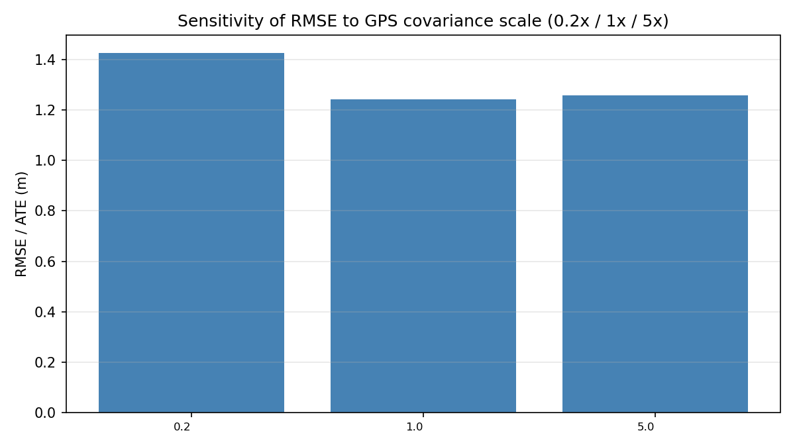⁩

⁦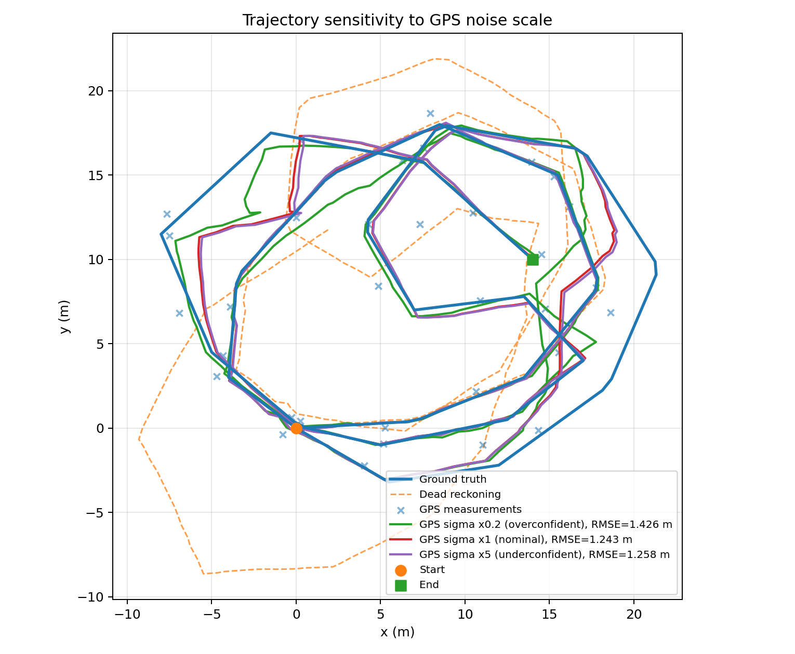⁩

تغییر کوواریانس GPS فقط یک تغییر عددی در RMSE نیست، بلکه شکل مسیر تخمین‌زده‌شده را نیز تغییر می‌دهد. در حالت ۰.۲ برابر، مدل بیش‌ازحد به GPS اعتماد می‌کند و اندازه‌گیری ناسازگار اثر بیشتری بر مسیر می‌گذارد.

⁦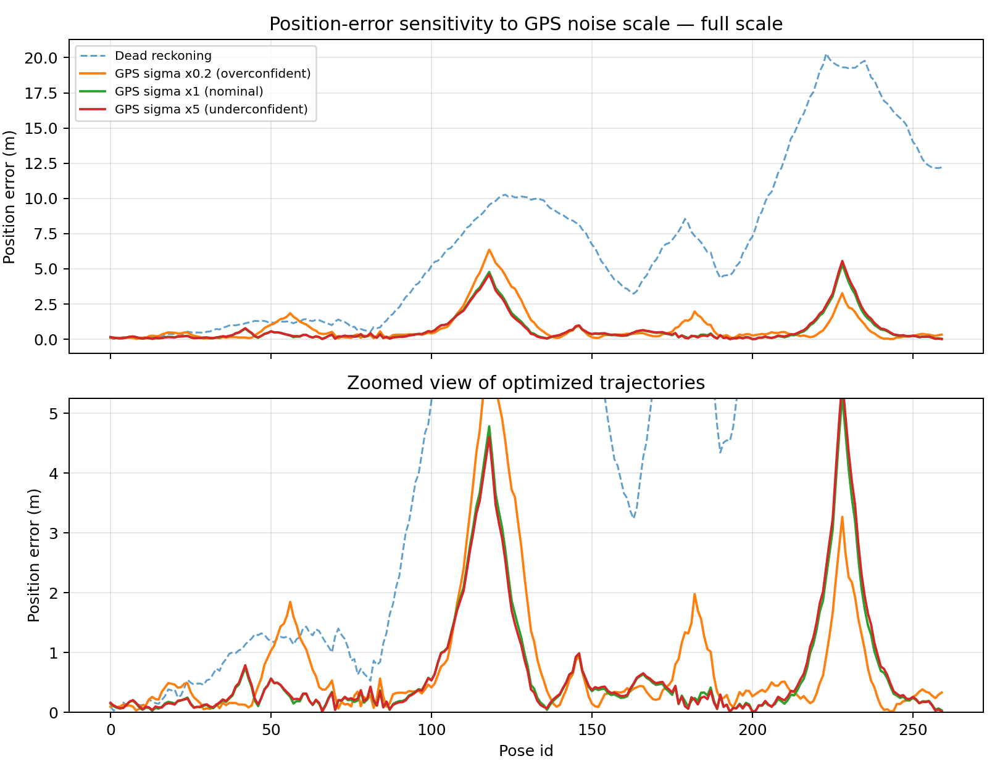⁩

اختلاف سه تنظیم در تمام مسیر یکنواخت نیست و بیشترین فاصله میان پاسخ‌ها در نواحی تحت تأثیر اندازه‌گیری ناسازگار ظاهر می‌شود.

⁦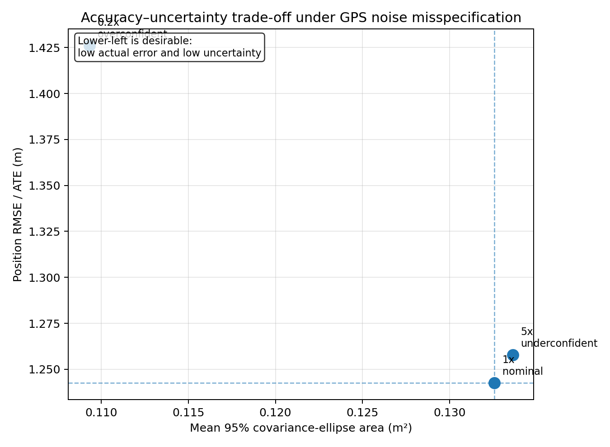⁩

نمودار دقت–عدم‌قطعیت نشان می‌دهد حالت ۰.۲ برابر با وجود RMSE بیشتر، بیضی کوچک‌تری گزارش می‌کند؛ بنابراین مدل هم خطای بیشتری دارد و هم نسبت به پاسخ نادرست خود بیش‌ازحد مطمئن است.

نکته‌ی کلیدی: با کوچک‌کردن ⁦$\sigma_{\text{gps}}$⁩، **⁦RMSE⁩ واقعی بدتر می‌شود (۱.۲۴۳→۱.۴۲۶) اما مساحت بیضی گزارش‌شده کوچک‌تر می‌شود (۰.۱۳۳→۰.۱۰۹)**. یعنی مدل هم‌زمان *غلط‌تر* و *مطمئن‌تر از خودش* می‌شود — چون یک اندازه‌گیری ⁦GPS⁩ پرت (⁦`meas_id=28`⁩, ⁦pose 231⁩) با ⁦$\sigma$⁩ کوچک وزن بسیار بالایی می‌گیرد و مسیر را به‌زور به سمت خودش می‌کشد. این پدیده نشان می‌دهد کوواریانس گزارش‌شده‌ی یک مدل گاوسی فقط به همان اندازه معتبر است که مدل نویزش با واقعیت بخواند.

### ۴.۳ داده‌ی ناسازگار — کدام فاکتورها بیشترین ناسازگاری را ایجاد کردند؟

بدون استفاده از هیچ برچسب پرت یا ⁦ground truth⁩، از روی باقی‌مانده‌ی همان جواب گاوسی:

| فاکتور | نُرم سفیدشده در جواب گاوسی |
|---|---:|
| ⁦`loop_7 (pose 118→228)`⁩ | **۱۰۳.۶** |
| ⁦`lm_45 (pose 120, landmark 3)`⁩ | ۳۴.۵ |
| ⁦`lm_44 (pose 115, landmark 3)`⁩ | ۲۸.۶ |
| ⁦`loop_6 (pose 42→146)`⁩ | ۲۴.۰ |
| ⁦`lm_89 (pose 230)`⁩ | ۲۳.۹ |

مجموع مربعات باقی‌مانده‌ی سفیدشده در جواب گاوسیِ کامل حدود ⁦$2\times10{,}446.5\approx20{,}892$⁩ روی ۱۰۷۰ مؤلفه‌ی باقی‌مانده است (میانگین ≈۱۹.۵ در برابر مقدار موردانتظار ۱ برای مدلی کاملاً سازگار با نویزش) — نشانه‌ی روشن ناسازگاری سیستماتیک بخشی از داده. فقط همین حدود ۱۵ فاکتور (از ۴۰۱) بیش از نیمی از این مجموع را می‌سازند.

**چرا نمی‌شود این‌ها را صرفاً حذف کرد؟** هیچ برچسب پرتی در داده‌ی دانشجو وجود ندارد و آستانه‌گذاری بر اساس ⁦ground truth⁩ تخلف محسوب می‌شود. راه‌حل به‌کاررفته، **⁦gating⁩ نرم مبتنی بر باقی‌مانده‌ی نرمال‌شده‌ی همان اجرا** است (بخش ۴.۴).

### ۴.۴ مدل مقاوم: ⁦IRLS-Huber⁩ روی نُرم کل فاکتور

⁦$\rho_a$⁩ در فرمول ⁦MAP⁩ روی **نُرم کل فاکتور** (⁦$\lVert r_a\rVert_{\Sigma_a^{-1}}$⁩) تعریف شده، نه روی مؤلفه‌های عددی جداگانه. به همین دلیل، مقاوم‌سازی با یک چرخه‌ی ⁦IRLS⁩ پیاده شده که دقیقاً همین نُرم برداری را می‌بیند:

<div dir="ltr" align="left">

$$w_a=\begin{cases}1 & \lVert r_a\rVert_{\Sigma_a^{-1}}\le\delta\\ \delta/\lVert r_a\rVert_{\Sigma_a^{-1}} & \text{در غیر این صورت}\end{cases}\qquad(\delta=2.5)$$

</div>

با وزن‌های فعلی یک زیرمسئله‌ی گاوسیِ بازوزن‌دهی‌شده حل می‌شود (⁦$r_a\to\sqrt{w_a}\,r_a$⁩)، سپس وزن‌ها از روی جواب جدید به‌روز می‌شوند؛ این چرخه تا پایدارشدن وزن‌ها و حالت تکرار می‌شود. در اجرای مرجع، مدل مقاوم **مستقیماً از همان Dead Reckoning مشترک همه‌ی مدل‌ها** آغاز شد و پس از ۱۴ تکرار بیرونی به همگرایی کامل رسید. بنابراین بهبود مدل مقاوم ناشی از Warm Start گاوسی نیست.

**نتیجه:** ⁦RMSE⁩ از ۱.۲۴۳ متر (گاوسی) به **۰.۱۵۵ متر** (مقاوم) رسید:

⁦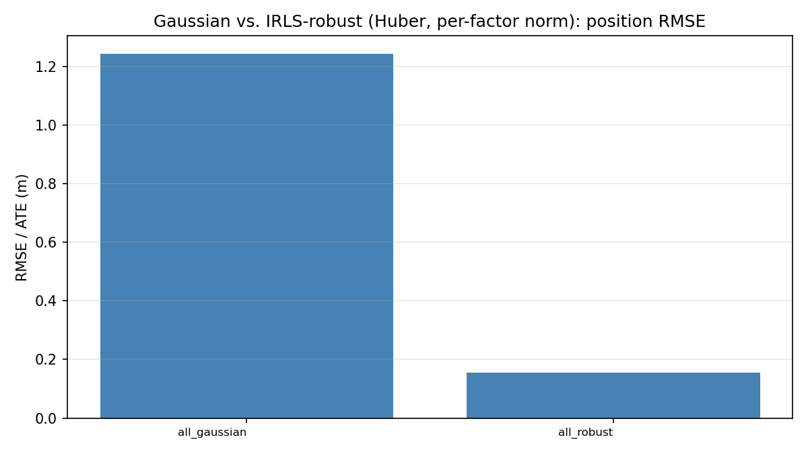⁩

| فاکتور | نُرم، جواب گاوسی | نُرم، جواب مقاوم | وزن نهایی |
|---|---:|---:|---:|
| ⁦`loop_7(118,228)`⁩ | ۱۰۳.۶ | ۱۶۵.۴ | **۰.۰۱۵** |
| ⁦`loop_6(42,146)`⁩ | ۲۴.۰ | ۳۵.۶ | **۰.۰۷۰** |
| ⁦`lm_88(pose 230)`⁩ | ۲۱.۳ | ۱۶.۸ | ۰.۱۴۹ |
| ⁦`lm_89(pose 230)`⁩ | ۲۳.۹ | ۳.۳ | ۰.۷۵۸ |
| ⁦`lm_45(pose 120)`⁩ | ۳۴.۵ | ۱.۴ | ۱.۰ |
| ⁦`lm_44(pose 115)`⁩ | ۲۸.۶ | ۰.۴ | ۱.۰ |

⁦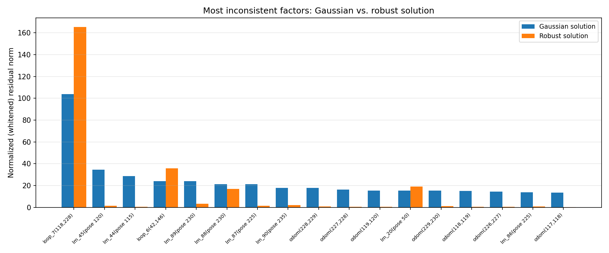⁩

نکته‌ی مهم: وزن یک فاکتور دائمی نیست. ⁦`lm_45`⁩ و ⁦`lm_44`⁩ در جواب گاوسی خیلی ناسازگار به نظر می‌رسیدند، اما وقتی مسیر حول دو بستن‌حلقه‌ی بد اصلاح شد، باقی‌مانده‌ی این دو خودش کوچک شد و به وزن کامل ۱ برگشت — این دو در واقع «قربانیِ» دو بستن‌حلقه‌ی ناسازگار بودند، نه خودشان مستقلاً معیوب. بزرگ‌ترشدن نُرم ⁦`loop_6`⁩/⁦`loop_7`⁩ در جواب مقاوم هم نشانه‌ی خرابی نیست: یعنی مسیر دیگر برای راضی‌نگه‌داشتن این دو فاکتورِ کم‌وزن خم نمی‌شود.

### ۴.۵ آزمون واقعی حساسیت به مقدار اولیه

برای آن‌که حساسیت به مقدار اولیه فقط از روی «استفاده از یک شروع مشترک» نتیجه‌گیری نشود، یک آزمایش مستقل اضافه شد. مدل‌های کامل گاوسی و مقاوم از سه مسیر اولیه‌ی قطعی و بدون استفاده از Ground Truth حل شدند:

- Dead Reckoning خام؛
- اغتشاش نرم خفیف با دامنه‌ی مکانی ۰.۵ متر و دامنه‌ی زاویه‌ای ۰.۰۵ رادیان؛
- اغتشاش نرم قوی با دامنه‌ی مکانی ۲ متر و دامنه‌ی زاویه‌ای ۰.۲۰ رادیان.

اغتشاش‌ها در طول مسیر به‌صورت نرم تغییر می‌کنند و در pose اول و آخر صفرند؛ بنابراین پرش غیرواقعی بین poseهای متوالی ایجاد نمی‌شود.

| مقدار اولیه | RMSE گاوسی (m) | هدف نهایی گاوسی | nfev گاوسی | RMSE مقاوم (m) | هدف نهایی مقاوم | nfev مقاوم |
|---|---:|---:|---:|---:|---:|---:|
| Dead Reckoning | ۱.۲۴۲۶۴۷ | ۱۰۴۴۶.۴۵۷۸۵۵ | ۶۰ | ۰.۱۵۴۶۵۸ | ۹۰۶.۱۹۹۳۳۶ | ۱۴۳ |
| اغتشاش نرم خفیف | ۱.۲۴۲۶۳۶ | ۱۰۴۴۶.۴۵۷۸۵۴ | ۷۰ | ۰.۱۵۴۶۵۸ | ۹۰۶.۱۹۹۳۳۶ | ۱۵۳ |
| اغتشاش نرم قوی | ۱.۲۴۲۶۳۳ | ۱۰۴۴۶.۴۵۷۸۵۳ | ۷۴ | ۰.۱۵۴۶۵۸ | ۹۰۶.۱۹۹۳۳۶ | ۱۵۷ |

⁦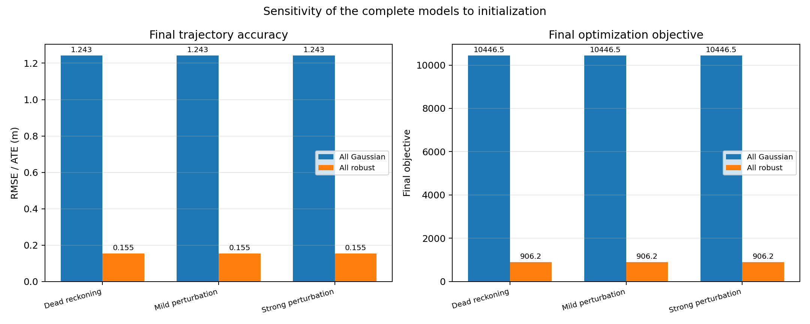⁩

هر شش اجرا همگرا شدند. تابع هدف نهایی سه اجرای گاوسی تا دقت بهتر از ⁦$2\times10^{-6}$⁩ یکسان است و تابع هدف مدل مقاوم تا دقت عددی تغییر نکرد. اغتشاش قوی تعداد ارزیابی‌های تابع را بیشتر می‌کند، اما مسیر نهایی مقاوم و RMSE آن را تغییر نمی‌دهد. بنابراین در محدوده‌ی اغتشاش‌های آزمایش‌شده، هر دو مدل کامل به یک حوضه‌ی حل محلی مشترک می‌رسند. این نتیجه شاهدی برای پایداری عملی نسبت به این شروع‌هاست، نه اثبات همگرایی سراسری برای هر مقدار اولیه‌ی دلخواه. مقادیر کامل در ⁦`results/tables/initialization_sensitivity.csv`⁩ ذخیره شده‌اند.

---

## ۵. نتایج عددی و نموداری

⁦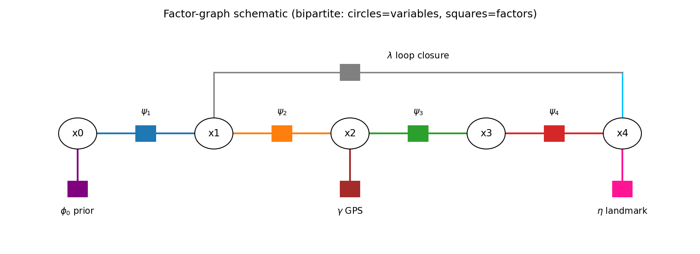⁩

*نمایش شماتیک بخشی از گراف فاکتوری: دایره‌ها متغیرها (⁦pose⁩ها)، مربع‌ها فاکتورها — دقیقاً همان نمایش دوبخشیِ گراف فاکتوری بخش ۵ سند.*

⁦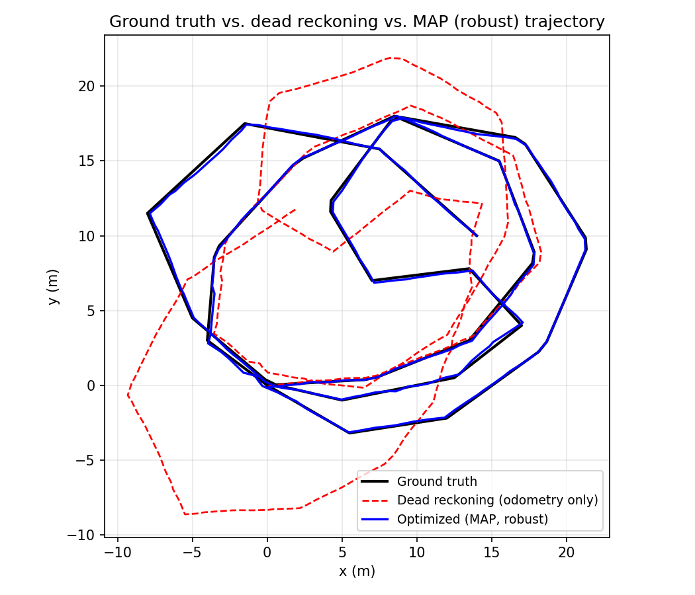⁩

*⁦Dead reckoning⁩ (قرمز) به دلیل رانش تجمعی اودومتری، به‌سرعت از مسیر مرجع (مشکی) فاصله می‌گیرد (⁦RMSE⁩≈۸.۹۲ متر). مسیر بهینه‌شده‌ی مقاوم (آبی) تقریباً روی مسیر مرجع می‌نشیند.*

⁦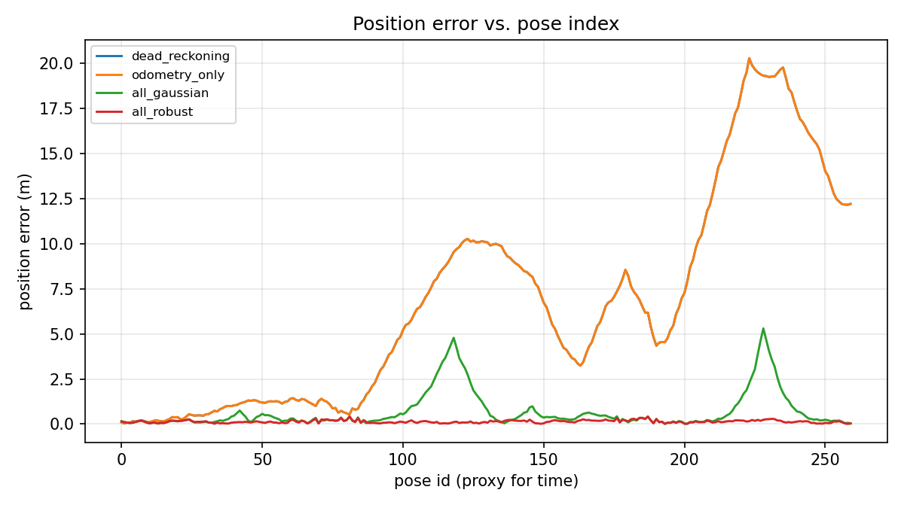⁩

*خطای مکانی برای چهار مدل. با مدل مقاوم (قرمز)، خطا در کل مسیر تقریباً صاف و نزدیک صفر می‌ماند؛ برآمدگی‌های محلی مدل گاوسی (سبز، اطراف ⁦pose⁩ ۱۱۸ و ۲۳۰) دقیقاً هم‌راستا با دو بستن‌حلقه‌ی ناسازگارند و در مدل مقاوم تقریباً محو شده‌اند.*

⁦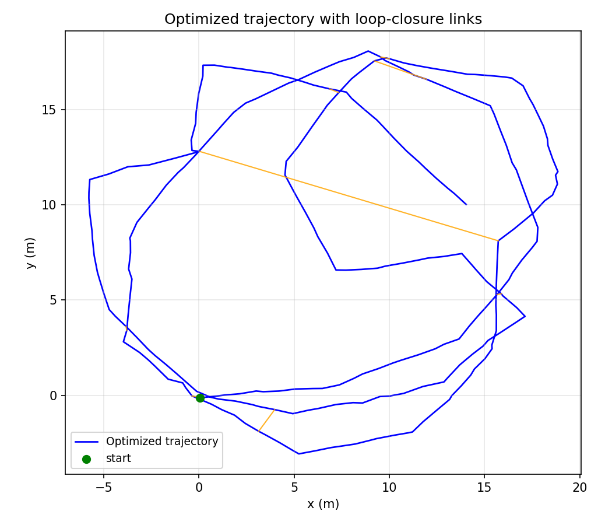⁩

*اتصالات نارنجی، بستن‌حلقه‌ها را روی مسیر بهینه‌شده نشان می‌دهند.*

جدول کامل ⁦ablation⁩، حساسیت نویز، حساسیت مقدار اولیه و مقایسه‌ی گاوسی/مقاوم به‌ترتیب در ⁦`results/tables/ablation_metrics.csv`⁩، ⁦`noise_sensitivity.csv`⁩، ⁦`initialization_sensitivity.csv`⁩ و ⁦`gaussian_vs_robust.csv`⁩ موجود است (شامل ⁦RMSE⁩، ⁦drift⁩ نهایی، خطای نسبی، خطای زاویه‌ای (⁦heading RMSE⁩)، مقدار هدف، زمان اجرا و تعداد تکرار).

معیارهای اضافی که در جدول‌ها گزارش شده‌اند: ⁦`heading_rmse_rad`⁩ (خطای ⁦RMS⁩ زاویه‌ی کامل نسبت به مرجع) و ⁦`relative_translation/rotation_rmse_m_lag5`⁩ (خطای حرکت نسبی در پنجره‌های ۵تایی، برای سنجش سازگاری محلی مسیر جدا از ⁦drift⁩ کلی). برای مدل کامل: ⁦heading RMSE⁩ از ۰.۱۰۱ رادیان (گاوسی) به ۰.۰۳۲ رادیان (مقاوم) بهبود یافت؛ خطای نسبی چرخشی از ۰.۱۲۱ به ۰.۰۴۰ رادیان.

---

## ۶. تحلیل عدم‌قطعیت و بیضی کوواریانس

کوواریانس حاشیه‌ای از تقریب لاپلاس حول نقطه‌ی ⁦MAP⁩ محاسبه می‌شود: ⁦$\Lambda=J^\top J$⁩ (ماتریس اطلاعات گاوس-نیوتن روی باقی‌مانده‌های سفیدشده)، سپس برای هر ⁦pose⁩ منتخب، بلوک ⁦$3\times3$⁩ متناظر از ⁦$\Lambda^{-1}$⁩ استخراج می‌شود — اما به‌جای وارون‌گیری چگالِ کل ماتریس ۷۸۰×۷۸۰، از تجزیه‌ی ⁦LU⁩ تُنُک استفاده می‌شود که فقط برای بلوک‌های موردنیاز حل می‌کند (⁦`selected_pose_covariances`⁩)؛ روشی که به گراف‌های بسیار بزرگ‌تر هم مقیاس‌پذیر می‌ماند.

مساحت بیضیِ عدم‌قطعیت با فرمول استاندارد ناحیه‌ی اطمینان یک گاوسیِ دوبعدی محاسبه شده: ⁦$\text{area}=\pi\,\chi^2_{0.95,2}\sqrt{\det\Sigma_{xy}}$⁩ با ⁦$\chi^2_{0.95,2}=5.991$⁩ — یعنی مساحت به یک سطح اطمینان آماریِ معنادار (۹۵٪) مربوط است.

⁦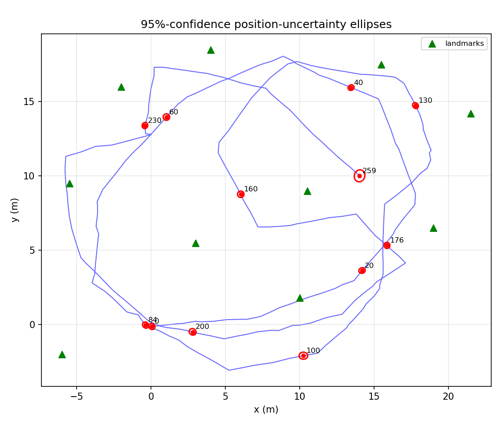⁩

| ⁦pose⁩ | فقط اودومتری (⁦m⁩²) | گاوسی کامل (⁦m⁩²) | مقاوم کامل (⁦m⁩²) |
|---|---:|---:|---:|
| ۰ | ۰.۴۲ | ۰.۱۳۵ | ۰.۱۳۶ |
| ۱۳۰ | ۹۵.۶ | ۰.۱۲۲ | ۰.۱۲۲ |
| ۲۳۰ | ۲۱۱.۴ | ۰.۱۲۵ | ۰.۱۶۱ |
| ۲۵۹ | ۱۴۳.۰ | ۰.۴۵۰ | ۰.۴۴۸ |

کاهش سه تا چهار مرتبه‌بزرگی در مساحت بیضی از «فقط اودومتری» به «کامل» نشان می‌دهد که ⁦GPS⁩، نقاط شاخص و بستن‌حلقه‌ها تا چه اندازه گراف را مقید می‌کنند. میان ⁦pose⁩های منتخب، مدل فقط اودومتری در ⁦pose⁩ ۲۳۰ به بزرگ‌ترین بیضی، برابر ۲۱۱.۳۵۷ مترمربع، می‌رسد. در مدل‌های کامل، بیشترین مساحت بیضیِ منتخب مربوط به ⁦pose⁩ ۲۵۹ است: ۰.۴۵۰ مترمربع در مدل گاوسی و ۰.۴۴۸ مترمربع در مدل مقاوم. ⁦pose⁩ ۲۵۹ یک مشاهده‌ی ⁦GPS⁩ دارد، اما مشاهده‌ی مستقیم نقطه‌ی شاخص یا سرِ بستن‌حلقه نیست؛ همچنین چون وضعیت انتهایی مسیر است، فقط از سمت وضعیت قبلی با اودومتری مقید می‌شود و ⁦GPS⁩ زاویه را مستقیماً اندازه نمی‌گیرد. در نتیجه، کوپل‌شدن عدم‌قطعیت زاویه و موقعیت باعث می‌شود عدم‌قطعیت این نقطه‌ی انتهایی از سایر ⁦pose⁩های منتخب بیشتر بماند.

به‌طور خلاصه: **بستن حلقه** عدم‌قطعیت کل بخش بین دو سر خود را هم‌زمان کاهش می‌دهد (چون یک قید مستقیم بین دو وضعیت دور از هم در زمان ایجاد می‌کند)، **⁦GPS⁩** فقط عدم‌قطعیت مکانی (نه زاویه‌ای) وضعیت محلی خودش را کم می‌کند، و **نقطه‌ی شاخص** چون هم فاصله هم زاویه‌ی نسبی می‌دهد، مثل یک ⁦GPS⁩ ضعیف‌تر اما با اطلاعات زاویه‌ای عمل می‌کند.

---

## ۷. بحث ⁦PGM: Markov blanket⁩، تنکی، ترتیب حذف متغیر، و متغیر نهان قابلیت اعتماد

### تنکی ماتریس اطلاعات

ماتریس اطلاعات گاوس-نیوتن ⁦$\Lambda=J^\top J$⁩ در نقطه‌ی ⁦MAP⁩، بُعد ⁦$780\times780$⁩ دارد و در نتیجه‌ی مرجع ۶۰۷۴ درایه‌ی عددیِ ناصفر دارد (چگالی حدود ۱٪) — بازتاب مستقیم ساختار مارکوفی بخش ۲: هر بلوکِ ⁦$x_t$⁩ فقط با همسایگان زمانی‌اش و (در صورت وجود) با انتهای دیگر یک بستن‌حلقه مرتبط است.

⁦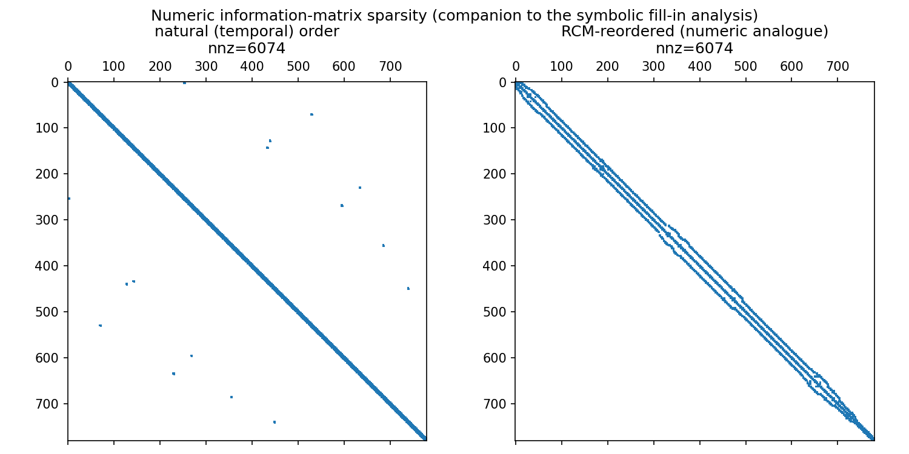⁩

### ⁦fill-in⁩ واقعی: شبیه‌سازی الگوریتم حذف متغیر

برای سنجش هزینه‌ی استنتاج دقیق، الگوریتم حذف متغیر مستقیماً روی گراف ⁦pose⁩ها شبیه‌سازی شده (⁦`symbolic_fill_in`⁩): هر گره به ترتیب حذف می‌شود؛ هر بار همسایه‌های باقی‌مانده‌اش به‌هم متصل می‌شوند («یال ⁦fill-in⁩»)، و اندازه‌ی بزرگ‌ترین کلیک شمرده می‌شود. این دقیقاً تعریف گراف القایی (⁦induced graph⁩) در استنتاج دقیق روی گراف‌های احتمالاتی است.

| ترتیب حذف | یال‌های ⁦fill-in⁩ | بزرگ‌ترین کلیک |
|---|---:|---:|
| زمانی (⁦$0\to259$⁩) | ۸۷۳ | ۸ |
| زمانی معکوس (⁦$259\to0$⁩) | ۸۷۳ | ۸ |
| **حریصانه‌ی ⁦min-degree⁩** | **۲۵۵** | **۶** |

⁦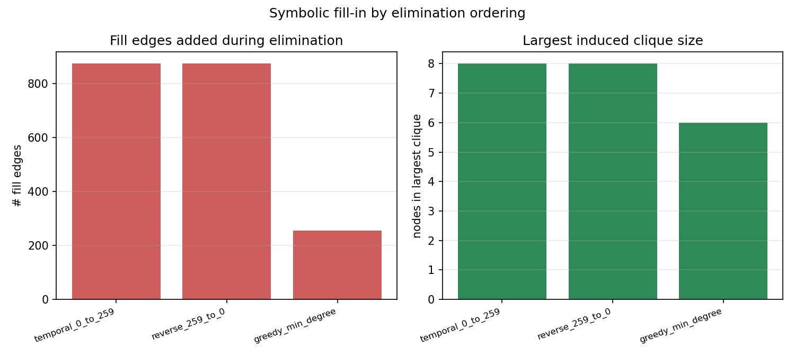⁩

هر ۸ بستن‌حلقه دقیقاً یک یال بین دو ⁦pose⁩ دور از هم در زمان اضافه می‌کند. در ترتیب زمانی، حذف ⁦pose⁩های میانیِ بین دو سرِ یک حلقه باعث می‌شود همبستگی آن‌ها به همه‌ی ⁦pose⁩های بینابین «نشت» کند (⁦fill-in⁩ سنگین). ترتیب‌دهی حریصانه‌ی ⁦min-degree⁩ — که در هر مرحله گره با کمترین همسایه‌ی باقی‌مانده را حذف می‌کند (⁦`greedy_min_degree_order`⁩) — بخش زیادی از این نشت را دور می‌زند: ⁦fill-in⁩ به کمتر از یک‌سوم و بزرگ‌ترین کلیک از ۸ به ۶ می‌رسد. این نشان می‌دهد هزینه‌ی استنتاج دقیق به‌شدت به ترتیب حذف متغیر بستگی دارد، و بستن‌حلقه‌ها دقیقاً همان عاملی‌اند که گراف را از یک زنجیره‌ی ساده (که فوق‌العاده ارزان حذف می‌شود) به گرافی با یال‌های دوردست تبدیل می‌کنند.

### ارتباط مدل مقاوم با متغیر نهان قابلیت اعتماد

یک راه نظری برای مدل‌سازی داده‌ی پرت، معرفی یک متغیر نهان قابلیت اعتماد ⁦$s_m\in\{0,1\}$⁩ برای هر اندازه‌گیری و یک مدل آمیخته‌ی
<div dir="ltr" align="left">

$$p(z_m\mid X)=\pi\,\mathcal N(r_m;0,\Sigma_m)+(1-\pi)\,\mathcal N(r_m;0,\kappa\Sigma_m),\qquad\kappa\gg1$$

</div>
است. می‌توان ⁦IRLS-Huber⁩ را از نظر شهودی به این متغیر نهان قابلیت اعتماد مرتبط دانست: باقی‌مانده‌های بزرگ اثر کمتری می‌گیرند، مشابه اندازه‌گیری‌هایی که احتمال معتبر بودنشان پایین‌تر است. بااین‌حال، وزن ⁦$w_a=\delta/\lVert r_a\rVert$⁩ **پسین دقیق** متغیر دودویی در مدل آمیخته‌ی بالا نیست؛ بنابراین این ارتباط یک تفسیر احتمالاتی و تقریب محاسباتی است، نه هم‌ارزی دقیق با الگوریتم EM. ساختار تکرار حل با وزن ثابت، به‌روزرسانی وزن از روی باقی‌مانده‌ی جدید و تکرار تا پایداری، رفتار EM-مانندی دارد، اما مسئولیت نرم ⁦$p(s_m\mid Z,X)$⁩ را محاسبه نمی‌کند.

این ارتباط با شواهد عددی بخش ۴.۴ هم تأیید می‌شود: دقیقاً همان دو فاکتوری (⁦`loop_6`⁩, ⁦`loop_7`⁩) که در بخش ۴.۳ به‌عنوان ناسازگارترین شناسایی شدند، کمترین وزن نهایی (۰.۰۷ و ۰.۰۱۵، معادل ⁦$s_m\approx0$⁩) را گرفتند؛ در حالی‌که فاکتورهایی که فقط به‌خاطر همسایگی با این دو ناسازگار به نظر می‌رسیدند (⁦`lm_44`⁩, ⁦`lm_45`⁩)، بعد از اصلاح مسیر به وزن کامل (معادل ⁦$s_m\approx1$⁩) بازگشتند.

---

## ۸. محدودیت‌ها، شکست‌ها و راهنمای اجرای دقیق

### محدودیت‌ها و شکست‌ها
- دو بستن‌حلقه‌ی ناسازگار (⁦`loop_6`⁩, ⁦`loop_7`⁩) همچنان محدودیت اصلی مدل گاوسی‌اند؛ اگر تعداد این‌گونه بستن‌حلقه‌ها زیاد شود، حتی ⁦IRLS-Huber⁩ هم ممکن است در یک کمینه‌ی محلی نامناسب گیر کند، چون ⁦IRLS⁩ فقط یک کمینه‌ساز محلی زیرگرادیانی است، نه استنتاج بیزی کامل روی ⁦$s_m$⁩.
- کوواریانس حاشیه‌ای، تقریب لاپلاس حول ⁦MAP⁩ است؛ در حضور غیرخطیت قوی (بستن‌حلقه‌های دوردست، مشاهدات فاصله-زاویه) ممکن است عدم‌قطعیت واقعی را دست‌کم بگیرد.
- آستانه‌ی ⁦Huber⁩ (⁦$\delta=2.5$⁩) یک ابرپارامتر انتخاب‌شده است، نه یادگرفته‌شده از داده. بخش ۴.۲ نشان داد یک ⁦$\Sigma$⁩ اشتباه می‌تواند مدل را هم‌زمان غلط‌تر و مطمئن‌تر از خودش کند؛ همین خطر برای انتخاب بد ⁦$\delta$⁩ هم صادق است.
- الگوریتم حذف متغیر و ترتیب‌دهی ⁦min-degree⁩ فقط برای تحلیل ساختاری استفاده شده‌اند (اثبات این‌که ترتیب اهمیت دارد)، نه برای خودِ حل عددی ⁦MAP⁩ که با ⁦least-squares⁩ انجام شده.
- فرض استقلال کامل نویز حسگرها (بدون بایاس سیستماتیک اودومتری، بدون هم‌بستگی زمانی نویز ⁦GPS⁩) در یک ربات واقعی به‌ندرت دقیقاً برقرار است.

### پاسخ به چک‌لیست نهایی سند

۱. **رانش فقط-اودومتری** در روند کلی تجمعی است، اما خطای مکانی در طول مسیر یکنواخت یا صعودیِ محض نیست. در نتیجه‌ی مرجع، بیشینه‌ی خطای مکانی ۲۰.۲۹۴ متر در ⁦pose⁩ ۲۲۳ است، ⁦drift⁩ نهایی ۱۲.۲۱۲ متر و ⁦RMSE⁩ کل مسیر ۸.۹۲۱ متر است.
۲. **مؤثرترین فاکتور منفرد** نقاط شاخص است (⁦RMSE⁩≈۰.۲۷ متر)؛ مؤثرترین ترکیب، مدل کامل مقاوم است (⁦RMSE⁩≈۰.۱۵۵ متر).
۳. ⁦$\sigma$⁩ **خیلی کوچک** باعث اعتماد کاذب می‌شود: ⁦RMSE⁩ بدتر می‌شود *و* بیضی کوواریانس کاذبانه کوچک‌تر می‌شود (بخش ۴.۲). ⁦$\sigma$⁩ خیلی بزرگ عملاً اثر حسگر را خنثی می‌کند.
۴. **بستن‌حلقه‌ی درست** عدم‌قطعیت کل بازه‌ی بین دو سرش را کاهش می‌دهد؛ **بستن‌حلقه‌ی ناسازگار** مسیر را کج می‌کند و در نبود حسگرهای دیگر می‌تواند نتیجه‌ی نهایی را به‌شدت خراب کند (⁦`odometry_loops`⁩: ⁦RMSE⁩≈۵.۷۳ متر).
۵. **محل بیشترین عدم‌قطعیت به مدل وابسته است.** میان ⁦pose⁩های منتخب، مدل فقط اودومتری در ⁦pose⁩ ۲۳۰ بزرگ‌ترین بیضی ۹۵٪ را با مساحت ۲۱۱.۳۵۷ مترمربع دارد که حاصل انباشت عدم‌قطعیت زنجیره است. در مدل‌های کامل، بیشترین بیضی منتخب در ⁦pose⁩ ۲۵۹ دیده می‌شود: ۰.۴۵۰ مترمربع در مدل گاوسی و ۰.۴۴۸ مترمربع در مدل مقاوم. با وجود مشاهده‌ی ⁦GPS⁩ در این ⁦pose⁩، نبود مشاهده‌ی مستقیم نقطه‌ی شاخص یا بستن‌حلقه، انتهایی‌بودن وضعیت و اندازه‌گیری‌نشدن مستقیم زاویه توسط ⁦GPS⁩ باعث می‌شود کوپل عدم‌قطعیت موقعیت–زاویه در این نقطه بیشتر باقی بماند.
۶. **ارتباط مدل مقاوم با ⁦PGM:⁩** وزن‌دهی ⁦IRLS-Huber⁩ را می‌توان به‌صورت یک تقریب محاسباتی با رفتار مشابه متغیر نهان قابلیت اعتماد ⁦$s_m$⁩ تفسیر کرد، ولی این روش معادل دقیق EM برای مدل آمیخته نیست (بخش ۷).
۷. **حساسیت به مقدار اولیه:** برای مدل‌های کامل گاوسی و مقاوم یک آزمایش مستقیم با سه مقدار اولیه انجام شد: Dead Reckoning، اغتشاش نرم خفیف و اغتشاش نرم قوی. هر شش اجرا به جواب‌های نهایی عددیِ معادل رسیدند؛ اغتشاش قوی فقط تعداد `nfev` را افزایش داد و RMSE یا تابع هدف نهایی را به‌طور معنادار تغییر نداد (بخش ۴.۵).
۸. **فرض‌های محتمل‌الن‌قض:** استقلال کامل نویز حسگرها، نبود بایاس سیستماتیک اودومتری، ثابت‌وقطعی‌بودن نقاط شاخص، عدم هم‌بستگی زمانی نویز ⁦GPS.⁩

### راهنمای اجرای دقیق

**محیط اجرای مرجع:** Python 3.12.2، ⁦`numpy==2.3.5`⁩، ⁦`pandas==2.2.3`⁩، ⁦`scipy==1.17.0`⁩، ⁦`matplotlib==3.10.8`⁩ و ⁦`PyYAML==6.0.3`⁩. این نسخه‌ها در ⁦`requirements.txt`⁩ ثبت شده‌اند.

<div dir="ltr" align="left">

دستورهای زیر را از پوشه‌ای اجرا کنید که پوشه‌ی استخراج‌شده‌ی ⁦`robot/`⁩ داخل آن قرار دارد:

```bash
cd robot
python3 -m pip install -r requirements.txt
python3 -m unittest discover -s tests -v      # صحت‌سنجی ژاکوبین تحلیلی + قرارداد داده
python3 scripts/run_project.py                 # اجرای کامل، تولید همه‌ی شکل‌ها/جدول‌ها
```

</div>

**خروجی‌ها:**
- شکل‌ها: ⁦`results/figures/*.png`⁩
- جدول‌ها: ⁦`results/tables/*.csv`⁩ (شامل ⁦`markov_blanket_pose0.json`⁩, ⁦`symbolic_fill_in.csv`⁩)
- اعداد خام کامل: ⁦`results/results.json`⁩
- مسیرهای تخمین‌زده‌شده‌ی هر مدل: ⁦`results/trajectories/*.csv`⁩

در اجرای مرجع ثبت‌شده در ⁦`results/results.json`⁩، زمان کل Pipeline حدود ۱۶.۱ ثانیه بود. این مقدار به پردازنده، نسخه‌ی کتابخانه‌ها و بار سیستم وابسته است. همه‌ی شکل‌ها مستقیماً از کد تولید شده‌اند، بدون هیچ ویرایش دستی.

</div>
